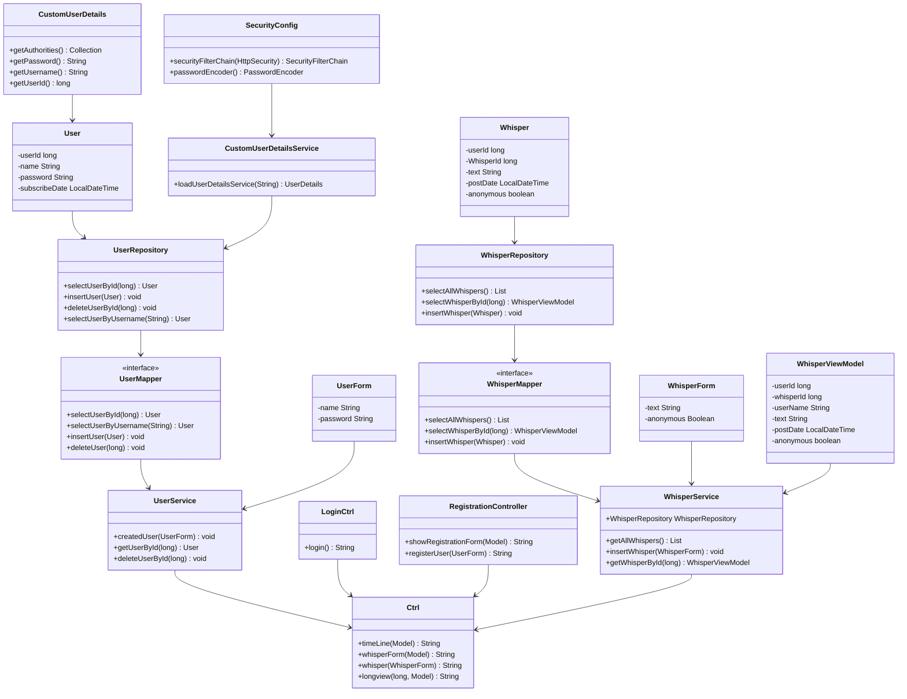

# Class

```mermaid
classDiagram
    class UserService {
        +createdUser(UserForm) void
        +getUserById(long) User
        +deleteUserById(long) void
    }
    class User {
        -userId long
        -name String
        -password String
        -subscribeDate LocalDateTime
    }
    class UserRepository {
        +selectUserById(long) User
        +insertUser(User) void
        +deleteUserById(long) void
        +selectUserByUsername(String) User
    }
    class UserMapper {
        <<interface>>
        +selectUserById(long) User
        +selectUserByUsername(String) User
        +insertUser(User) void
        +deleteUser(long) void
    }
    class UserForm {
        -name String
        -password String
    }
    class WhisperService {
        +WhisperRepository WhisperRepository
        +getAllWhispers() List<WhisperViewModel>
        +insertWhisper(WhisperForm) void
        +getWhisperById(long) WhisperViewModel
    }
    class Whisper {
        -userId long
        -WhisperId long
        -text String
        -postDate LocalDateTime
        -anonymous boolean
    }
    class WhisperRepository {
        +selectAllWhispers() List<WhisperViewModel>
        +selectWhisperById(long) WhisperViewModel
        +insertWhisper(Whisper) void
    }
    class WhisperMapper {
        <<interface>>
        +selectAllWhispers() List<WhisperViewModel>
        +selectWhisperById(long) WhisperViewModel
        +insertWhisper(Whisper) void
    }
    class WhisperForm {
        -text String
        -anonymous Boolean
    }
    class WhisperViewModel {
        -userId long
        -whisperId long
        -userName String
        -text String
        -postDate LocalDateTime
        -anonymous boolean
    }

    class CustomUserDetails {
        +getAuthorities() Collection<? extends GrantedAuthority>
        +getPassword() String
        +getUsername() String
        +getUserId() long
    }
    class CustomUserDetailsService {
        +loadUserDetailsService(String) UserDetails
    }
    class SecurityConfig {
        +securityFilterChain(HttpSecurity) SecurityFilterChain
        +passwordEncoder() PasswordEncoder
    }

    class Ctrl {
        +timeLine(Model) String
        +whisperForm(Model) String
        +whisper(WhisperForm) String
        +longview(long, Model) String
    }
    class LoginCtrl{
        +login() String
    }
    class RegistrationController{
        +showRegistrationForm(Model) String
        +registerUser(UserForm) String
    }

    User --> UserRepository
    UserMapper --> UserService
    UserRepository --> UserMapper
    UserForm --> UserService
    CustomUserDetails --> User
    CustomUserDetailsService --> UserRepository
    SecurityConfig --> CustomUserDetailsService
    Whisper --> WhisperRepository
    WhisperMapper --> WhisperService
    WhisperRepository --> WhisperMapper
    WhisperForm --> WhisperService
    WhisperViewModel --> WhisperService
    UserService --> Ctrl
    LoginCtrl --> Ctrl
    RegistrationController --> Ctrl
    WhisperService --> Ctrl


```

# ER

```mermaid
erDiagram
    users {
        long user_id PK
        string name
        string password
        datetime subscribe_date
    }
    whisper {
        long whisper_id PK
        long user_id FK
        string text
        datetime post_date
        boolean anonymous
    }
    users ||--o{ whisper  :"posts"
```
