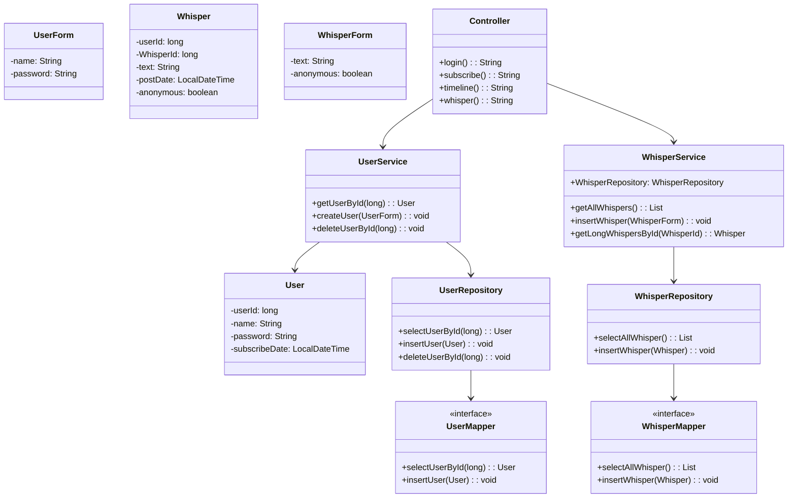
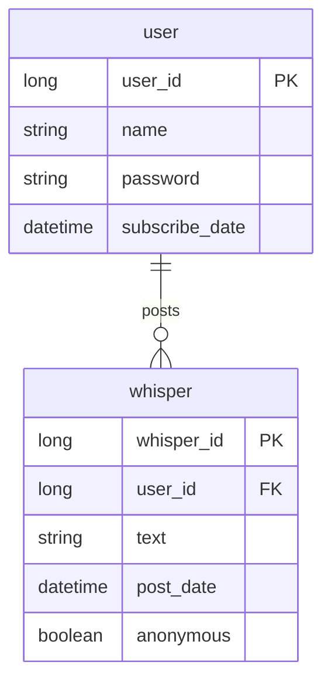

# Class

```mermaid
classDiagram
    class UserService {
        +getUserById(long): User
        +createUser(UserForm): void
        +deleteUserById(long): void
    }
    class User {
        -userId: long
        -name: String
        -password: String
        -subscribeDate: LocalDateTime
    }
    class UserRepository {
        +selectUserById(long): User
        +insertUser(User): void
        +deleteUserById(long): void
    }
    class UserMapper {
        <<interface>>
        +selectUserById(long): User
        +insertUser(User): void
    }
    class UserForm {
        -name: String
        -password: String
    }
    class WhisperService {
        +WhisperRepository: WhisperRepository
        +getAllWhispers(): List<Whisper>
        +insertWhisper(WhisperForm): void
        +getLongWhispersById(WhisperId): Whisper
    }
    class Whisper {
        -userId: long
        -WhisperId: long
        -text: String
        -postDate: LocalDateTime
        -anonymous: boolean
    }
    class WhisperRepository {
        +selectAllWhisper(): List<Whisper>
        +insertWhisper(Whisper): void
    }
    class WhisperMapper {
        <<interface>>
        +selectAllWhisper(): List<Whisper>
        +insertWhisper(Whisper): void
    }
    class WhisperForm {
        -text: String
        -anonymous: boolean
    }
    class Controller {
        +login(): String
        +subscribe(): String
        +timeline(): String
        +whisper(): String
    }

    UserService --> User
    UserService --> UserRepository
    UserRepository --> UserMapper
    WhisperService --> WhisperRepository
    WhisperRepository --> WhisperMapper
    Controller --> UserService
    Controller --> WhisperService
```
# ER

```mermaid
erDiagram
    user {
        long user_id PK
        string name
        string password
        datetime subscribe_date
    }
    whisper {
        long whisper_id PK
        long user_id FK
        string text
        datetime post_date
        boolean anonymous
    }
    user ||--o{ whisper : "posts"
```