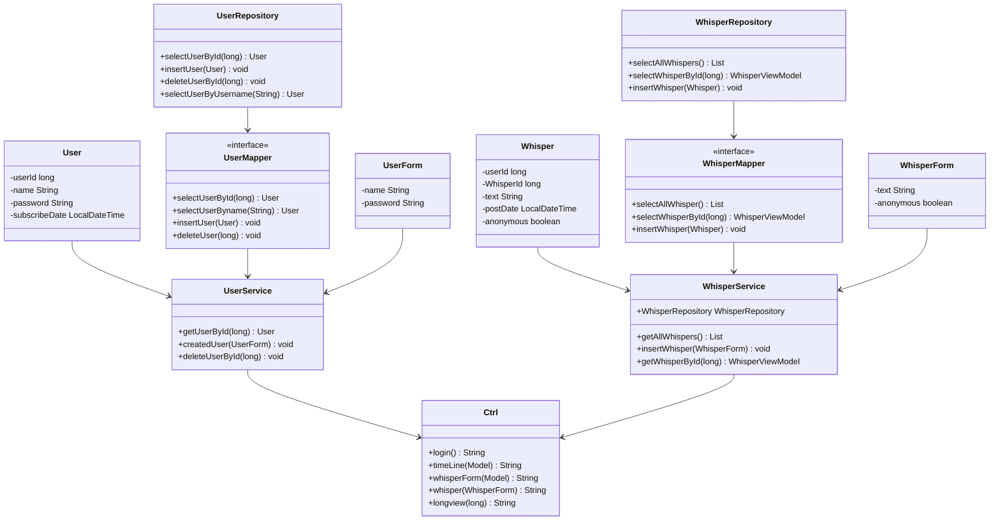
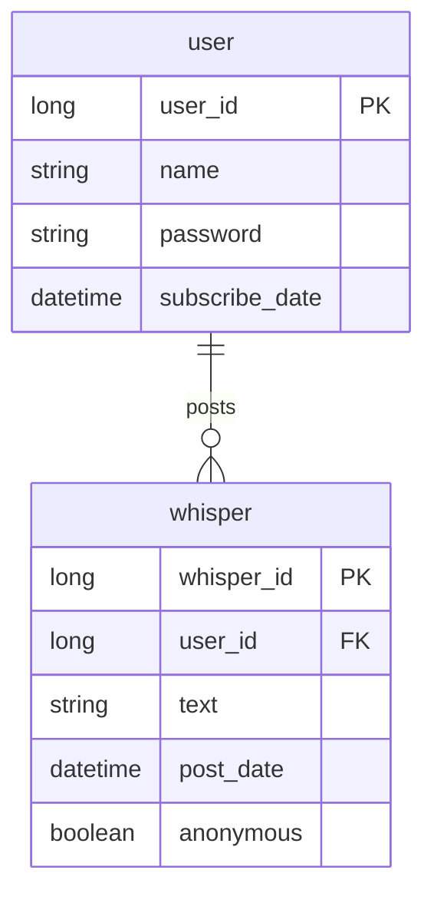

# Class

```mermaid
classDiagram
    class UserService {
        +getUserById(long) User
        +createdUser(UserForm) void
        +deleteUserById(long) void
    }
    class User {
        -userId long
        -name String
        -password String
        -subscribeDate LocalDateTime
    }
    class UserRepository {
        +selectUserById(long) User
        +insertUser(User) void
        +deleteUserById(long) void
        +selectUserByUsername(String) User
    }
    class UserMapper {
        <<interface>>
        +selectUserById(long) User
        +selectUserByname(String) User
        +insertUser(User) void
        +deleteUser(long) void
    }
    class UserForm {
        -name String
        -password String
    }
    class WhisperService {
        +WhisperRepository WhisperRepository
        +getAllWhispers() List<Whisper>
        +insertWhisper(WhisperForm) void
        +getWhisperById(long) WhisperViewModel
    }
    class Whisper {
        -userId long
        -WhisperId long
        -text String
        -postDate LocalDateTime
        -anonymous boolean
    }
    class WhisperRepository {
        +selectAllWhispers() List<WhisperViewModel>
        +selectWhisperById(long) WhisperViewModel
        +insertWhisper(Whisper) void
    }
    class WhisperMapper {
        <<interface>>
        +selectAllWhisper() List<WhisperViewModel>
        +selectWhisperById(long) WhisperViewModel
        +insertWhisper(Whisper) void
    }
    class WhisperForm {
        -text String
        -anonymous boolean
    }
    class Ctrl {
        +login() String
        +timeLine(Model) String
        +whisperForm(Model) String
        +whisper(WhisperForm) String
        +longview(long) String
    }

    User --> UserService
    UserMapper --> UserService
    UserRepository --> UserMapper
    UserForm --> UserService
    Whisper --> WhisperService
    WhisperMapper --> WhisperService
    WhisperRepository --> WhisperMapper
    WhisperForm --> WhisperService
    UserService --> Ctrl
    WhisperService --> Ctrl
```
# ER

```mermaid
erDiagram
    user {
        long user_id PK
        string name
        string password
        datetime subscribe_date
    }
    whisper {
        long whisper_id PK
        long user_id FK
        string text
        datetime post_date
        boolean anonymous
    }
    user ||--o{ whisper  :"posts"
```